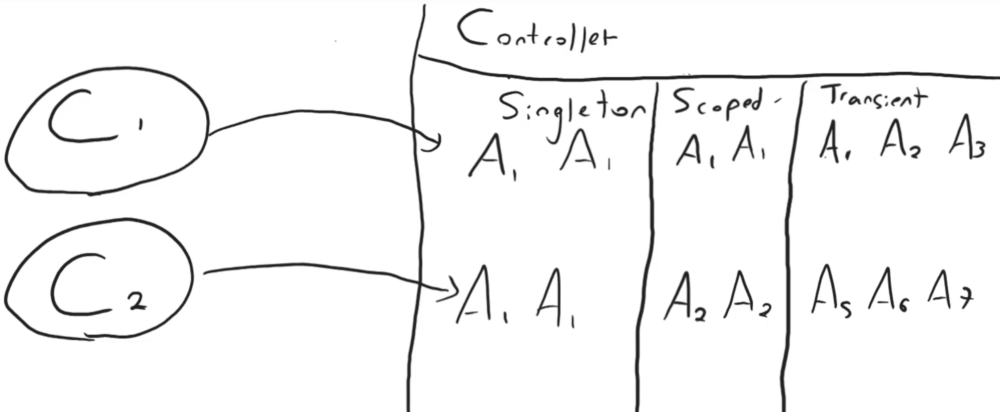
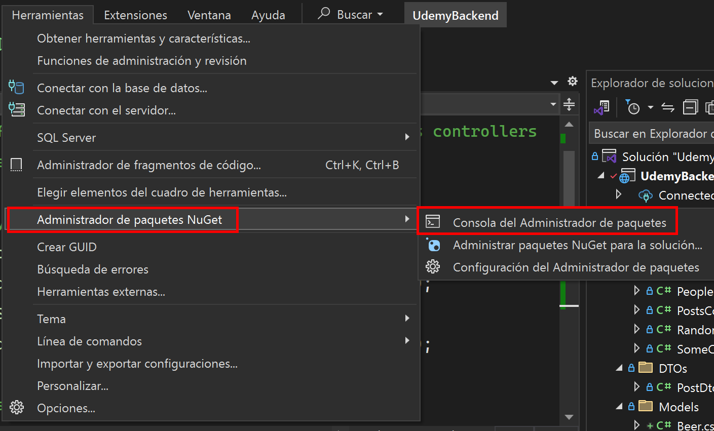
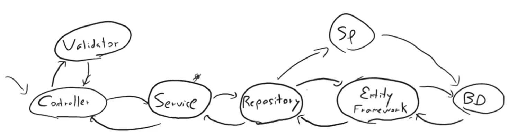

# Apuntes de Backend con .NET

.NET es un marco de trabajo que nos ira indicando la estructura que debe tener nuestro proyecto para conecta, para nombrar etc. Para dejar en claro, _.NET Framework_ es privado, en cambio, _.NET Core_ es la parte Open Source y multiplataforma que luego pasó a llamarse solo .NET.

### Datos

- `{ get; set; }` permiten leer y modificar la variable
- `Func` funciones que retornar datos
- `Action` funciones que no devuelven nada

El **controllers** (base del endpoint) es una clase que herada de la clase controller de .NET, el cual recibe una petición (request) del usuario y le devuelve una respuesta ya sea un HTML, JSON o cualquier datos necesario, y a su vez también puede recibir datos junto a esa petición.

El **services** es donde va la lógica de negocio y la validación de los datos los cuales son devueltos al controller.

**Tipos de inyección de dependencias**

- **Singleton**: siempre es el mismo objeto, único en todo el sistema
- **Scoped**: el objeto es distinto en cada solicitud
- **Transient**: es cuando el objeto es de una misma clase, pero cambia según la solicitud

**Models**

- **Modelo**: representación de una entidad en la base de datos (no siempre contiene los mismo datos de un DTO).
- **DTO (Data Transfers Object)**: objeto para la transferencia de datos, el cual tiene como ventaja indicar cuantos datos son los que viajan entre cada capa.

Cuando se mando un JSON en el body, .NET lo toma de manera automática y lo serializa para usar esa informacion en nuestro código.

La diferencia entre un **List** y un **IEnumerable**, es que List es una clase que contiene muchos métodos para la manipulación de datos, en cambio, IEnumerable (que es solo de lectura) solo tiene lo necesario para iterar datos haciendo que sea más eficiente que List.

### Entity Framework

ORM que tiene por defecto .NET, el cual permite mapear una base de datos. Por ejemplo, si en la db existe una tabla _user_, Entity la llevará al código en forma de clase y/o viceversa.

Las **migraciones** nos permite llevar un control de versiones de nuestra db, ver que cambios se han hecho con cada iteración y en caso de ser necesario hacer un rollback.

Para hacer una migración, se realiza mediante la _Consola del Administrador de paquetes_.

1. Generar una migración: `Add-Migration <nombre>`
2. Aplicar la migración en la db: `Update-Database`

Estos pasos se repiten cada que se hace alguna modificación del modelo.

- Revertir la migración: `Remove-Migration`

Paquetes a instalar mediante NuGet:

- Microsoft.EntityFrameworkCore.SqlServer
- Microsoft.EntityFrameworkCore.Tools

### Repository

Es la capa encargada de la persistencia de la información, y donde la capa de servicio solo se comienza a enfocar de la lógica de negocio. Esto quiere decir que si necesitamos el contexto de Entity lo haríamos mediante repository.

### AutoMappers

Técnica que nos ahorra la tarea de estar asignando valores campo a campo o la transformación de un objecto a otro.

_**Créditos:**_

👉 [https://www.udemy.com/course/aprende-programacion-backend-en-c-net/](https://www.udemy.com/course/aprende-programacion-backend-en-c-net/)  
👉 [https://github.com/emigallo-edu/net-web-api/blob/master/Presentations/content.md](https://github.com/emigallo-edu/net-web-api/blob/master/Presentations/content.md)
